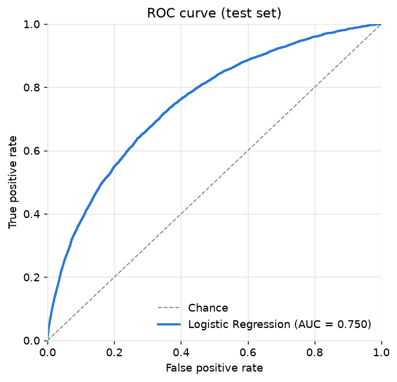
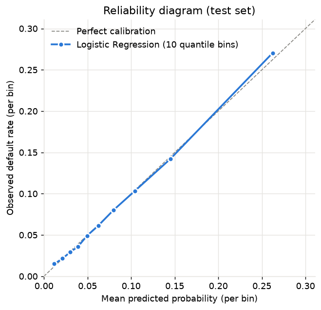

# RiskPilot AI

Credit Risk Decision Intelligence Platform, built incrementally from a rigorous
probabilistic baseline toward a full decision engine with explainability,
monitoring, a FastAPI service and an LLM-based AI Risk Analyst.

## Problem

A lender must decide whether to grant a loan before observing whether the
applicant will repay. The statistical object of interest is the **probability of
default**

```
P(Y = 1 | X = x)
```

where `Y = 1` means the client had payment difficulties (the Home Credit
`TARGET` definition) and `x` is what is known at application time. Everything
downstream (pricing, approval thresholds, expected-loss estimates, portfolio
monitoring) consumes that probability, so the model is judged on **probability
quality** (log loss, Brier score, calibration) and **ranking quality** (ROC-AUC,
PR-AUC), never on accuracy. Accuracy is meaningless at an ~8% default rate: a
model that rejects nobody is 92% "accurate".

## Current milestone: probabilistic baseline

This repository currently implements **Milestone 1**: a leakage-safe, reproducible
Logistic Regression baseline on the `application_train` table, with
probabilistic evaluation and a calibration analysis.

Status of this milestone:

| Component | State |
|---|---|
| Package (`riskpilot`): config, loader, validation, preprocessing, training, evaluation | implemented and unit-tested |
| Kaggle download helper (`python -m riskpilot.data.download`) | implemented |
| Real-data audit (`notebooks/01_data_understanding.ipynb`, `artifacts/metrics/data_validation.json`) | done, executed on the full table |
| Baseline run, metrics and figures (`python -m riskpilot.models.train`, `notebooks/02_baseline.ipynb`) | done, lbfgs converged, no warning suppressed |
| Technical report (`reports/baseline_report.md`) | done |

The numbers in this README are copied from `artifacts/metrics/baseline_metrics.json`
(run of 2026-09-16, scikit-learn 1.9.1) and from the executed notebooks; the report
explains every one of them.

## Dataset

[Home Credit Default Risk](https://www.kaggle.com/competitions/home-credit-default-risk)
(Kaggle). Milestone 1 uses **only** `application_train.csv` (one row per loan
application, 307,511 rows, 122 columns, binary `TARGET` with prevalence 8.07 %).
The relational tables
(bureau, previous applications, installments, ...) are reserved for the
feature-engineering milestone.

Raw data is **never committed**: `data/raw/` is git-ignored, and the file must be
obtained with the official Kaggle CLI after accepting the competition rules:

```bash
python -m riskpilot.data.download
# equivalent to:
# kaggle competitions download home-credit-default-risk -f application_train.csv -p data/raw
```

## Methodology

**Validation.** The application table has no application date (only the
weekday and hour of the appointment), so an honest temporal split is not
possible from this table alone. The baseline uses a stratified random holdout
(80% train / 20% test, `random_state=42`). The test partition is never touched
by any fitting step. Split membership is written to
`data/processed/baseline_split_membership.csv` so later milestones evaluate on
the identical rows.

**Leakage controls.**
- `SK_ID_CURR` is dropped before modeling; `TARGET` is separated first.
- Every learned transformation (median imputation, scaling, one-hot
  vocabularies) lives inside a scikit-learn `Pipeline` and is fitted on the
  training split only.
- Feature typing (numeric vs. categorical) is inferred from the training split.
- `riskpilot.data.validation.leakage_screen` flags suspicious column names and
  numeric features with an unusually high univariate AUC; results are reported,
  not silently acted upon.

**Preprocessing** (`riskpilot.features.preprocessing`).
- A stateless cleaning step maps the `DAYS_EMPLOYED == 365243` sentinel to
  missing so it is not treated as a magnitude of about +1000 years.
- Numeric: median imputation with missing-value indicators, then standardization.
- Categorical: explicit `"missing"` level, then `OneHotEncoder(handle_unknown="ignore")`
  (sparse output). Cardinality is inspected before encoding; the largest column
  in this table has a few dozen levels, so one-hot encoding is memory-safe.

**Model.** `LogisticRegression(solver="lbfgs", C=1.0, max_iter=1000)` with L2
regularization and **no class re-weighting**: re-weighting would shift the
predicted probabilities away from the true base rate, which is exactly what we
are trying to estimate. Convergence is checked and recorded, never suppressed.

**Evaluation** (`riskpilot.models.evaluate`).
- Ranking: ROC-AUC, average precision (PR-AUC) with the prevalence as reference.
- Probability quality: log loss and Brier score, each next to the score of a
  constant "predict the prevalence" model; Brier skill score.
- Calibration: quantile-binned reliability table, expected calibration error, a
  slope/intercept diagnostic (logistic fit of the outcome on the predicted
  log-odds; measured, never applied), reliability diagram and
  predicted-probability distribution by class.

## Metrics

Test partition: 61,503 applications (4,965 defaults, prevalence 0.0807), never
touched by any fitting step. "Null model" is the constant prediction of the
prevalence; for the calibration rows the reference is the ideal value.

| Metric | Test | Train | Null model / ideal |
|---|---|---|---|
| ROC-AUC | **0.7504** | 0.7512 | 0.5 |
| Average precision (PR-AUC) | **0.2353** | 0.2292 | 0.0807 |
| Log loss | **0.2482** | 0.2484 | 0.2805 |
| Brier score | **0.0682** | 0.0684 | 0.0742 |
| Brier skill score | **0.081** | 0.078 | 0 |
| Expected calibration error (10 quantile bins) | **0.0021** | 0.0010 | 0 |
| Calibration slope / intercept | **1.006 / 0.015** | 1.001 / 0.002 | 1 / 0 |

Model: `LogisticRegression(solver="lbfgs", C=1.0, max_iter=1000)`, L2 penalty, no
class weights, 312 transformed features (104 numeric + 62 missing indicators +
146 one-hot), converged in 123 iterations, fit time about 30 s.

What the numbers say:

- Ranking is moderate (ROC-AUC 0.75, precision about 0.33 at 20 % recall), the
  expected level for a linear model on the raw application table.
- The probabilities are calibrated: mean prediction 0.0805 vs observed 0.0807,
  slope 1.006, every decile gap below one percentage point; the largest gap is a
  slight under-prediction in the top decile (0.262 predicted vs 0.270 observed,
  inside its 95 % interval). Only 0.18 % of test applicants are scored above 0.5,
  so the high-probability tail is not estimable. There is no evidence that would
  justify recalibrating this model; its limitation is discrimination.
- Train and test agree to the third decimal: no overfitting.

| ROC curve | Reliability diagram |
|---|---|
|  |  |

Also generated: `artifacts/figures/baseline_precision_recall_curve.png` and
`artifacts/figures/baseline_probability_distribution.png`.

## What the real data showed

Verified in `notebooks/01_data_understanding.ipynb` against the assumptions the
package was written with (numbers and details in `reports/baseline_report.md`):

- 307,511 × 122, no duplicate rows or ids; `SK_ID_CURR` carries no signal
  (univariate AUC 0.498) and is dropped.
- 67 columns have gaps, 41 more than half. The missingness is structural (the
  building-description block, `OWN_CAR_AGE` when there is no car, `EXT_SOURCE_1`),
  so the missing indicators are features and nothing is dropped.
- `DAYS_EMPLOYED == 365243` on 18.0 % of rows is exactly the pensioners and the
  unemployed (and exactly the `ORGANIZATION_TYPE == "XNA"` rows), and the only
  positive value in any `DAYS_*` column: a documented convention, mapped to
  missing plus an indicator, not corruption.
- `XNA` in `ORGANIZATION_TYPE` is a real level; `CODE_GENDER == "XNA"` (4 rows)
  and `NAME_FAMILY_STATUS == "Unknown"` (2 rows) are negligible defects kept as
  rare one-hot levels.
- Highest cardinality is 58 levels; the one-hot block has 146 columns. The design
  matrix ends up dense (614 MB for the training split) because the numeric block
  dominates, which is acceptable and is what the fit time reflects.
- No leakage candidate: the strongest single features are the external scores
  `EXT_SOURCE_3/1/2` (univariate AUC 0.66–0.68), legitimate at application time.
- One applicant reports an income of 117,000,000, which inflates the standard
  deviation of `AMT_INCOME_TOTAL` 2.4×; 18 standardized columns (near-constant
  flags, rare missing indicators, heavy-tailed counts) contain a training row at
  |z| > 50, three of them near 500. The fitted coefficients on those
  columns are a few thousandths, so no other applicant's score is distorted, but
  income is effectively unused. Left unchanged for the baseline and recorded as a
  candidate revision to be compared on the same split in the next milestone.
- Two runtime warnings appeared on the first real run and were fixed in code
  rather than silenced: the package `__init__` double-imported the CLI module,
  and the metrics file recorded the penalty as `"deprecated"` (scikit-learn 1.8+);
  the model is L2 and is now recorded by name. No `ConvergenceWarning` occurred.

## Architecture

```text
riskpilot-ai/
├── data/
│   ├── raw/                  # application_train.csv (git-ignored)
│   └── processed/            # split membership etc. (git-ignored)
├── notebooks/                # 01_data_understanding, 02_baseline (executed, outputs kept)
├── src/riskpilot/
│   ├── config.py             # pathlib-based paths, RANDOM_STATE, column names, sentinels
│   ├── data/
│   │   ├── download.py       # Kaggle CLI wrapper + verification
│   │   ├── load.py           # loader with required-column checks
│   │   └── validation.py     # overview, missingness, cardinality, anomalies, leakage screen
│   ├── features/
│   │   └── preprocessing.py  # cleaning step, ColumnTransformer, baseline Pipeline
│   └── models/
│       ├── train.py          # CLI: split -> fit -> evaluate -> persist artifacts
│       └── evaluate.py       # metrics, calibration table, figures
├── tests/                    # pytest suite on small synthetic fixtures
├── artifacts/
│   ├── figures/              # ROC, PR, reliability, probability distribution (PNG)
│   ├── metrics/              # baseline_metrics.json, data_validation.json
│   └── models/               # baseline pipeline (joblib, git-ignored)
├── reports/                  # baseline_report.md (technical report of Milestone 1)
├── pyproject.toml
└── README.md
```

## Reproduction (Windows-friendly)

```powershell
git clone https://github.com/bertolucci-rl/riskpilot-ai.git
cd riskpilot-ai
py -3.12 -m venv .venv
.\.venv\Scripts\Activate.ps1
python -m pip install --upgrade pip
pip install -e ".[dev]"

# Kaggle: log in once (OAuth) or set KAGGLE_API_TOKEN, and accept the competition rules at
# https://www.kaggle.com/competitions/home-credit-default-risk/rules
kaggle auth login
python -m riskpilot.data.download

# Train + evaluate the baseline, write metrics/figures/model (about 50 s)
python -m riskpilot.models.train

# Notebooks, executed in place: 01 audits the data, 02 re-runs and analyses the baseline
jupyter nbconvert --to notebook --execute --inplace notebooks/01_data_understanding.ipynb
jupyter nbconvert --to notebook --execute --inplace notebooks/02_baseline.ipynb

# Quality checks
pytest
ruff check src tests
```

On macOS/Linux replace the activation line with `source .venv/bin/activate`.

## Roadmap

1. Challenger models (gradient boosting) against the same split and metrics.
2. Feature engineering across the relational tables (bureau, previous applications, installments).
3. Probability calibration (Platt / isotonic) with proper held-out comparison.
4. Cost-sensitive Decision Engine (expected-loss thresholds, approve/review/decline).
5. Explainability (global and per-decision).
6. FastAPI scoring service.
7. Model monitoring (drift in inputs and in probability distributions).
8. AI Risk Analyst with LLM tool calling over the scoring and explanation APIs.
9. RAG over credit policies.
10. AI evaluation harness for the analyst.

None of items 1-10 is implemented yet.

## License

MIT
