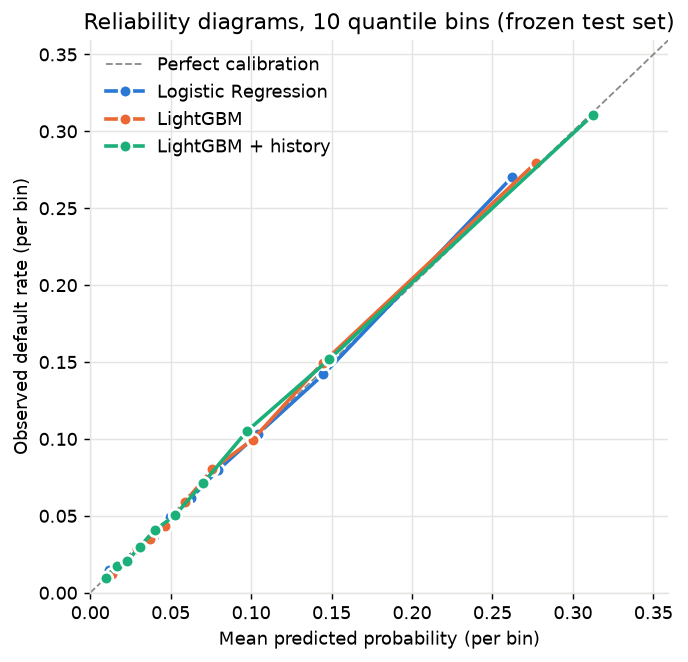

# Milestone 3: corrected relational credit-history features

The September 21 repair supersedes the recovered, incomplete September 17 result.
See [repair report](ms3_repair_report.md) and [historical recovery audit](relational_recovery_audit.md).
The question remains whether historical information improves the accepted
application-only LightGBM, using controlled source ablation rather than broad tuning.

## Data and engineering

Official Kaggle raw files remain local and ignored. Sources are processed one at
a time using explicit columns, compact dtypes and customer-level Parquet caches.
Bureau combines two physical tables; its build time covers both. Raw customer
counts include competition-test IDs; coverage uses only the frozen training population.

| Source | Raw rows | Customers in raw source | Features (+ history flag) | Training coverage | Build s | Output MB |
| --- | --- | --- | --- | --- | --- | --- |
| bureau | 1,716,428 + 27,299,925 | 305,811 | 48 + 1 | 85.7% | 42.0 | 59.9 |
| previous | 1,670,214 | 338,857 | 41 + 1 | 94.6% | 19.6 | 56.9 |
| installments | 13,605,401 | 339,587 | 25 + 1 | 94.8% | 35.0 | 35.3 |
| credit_card | 3,840,312 | 103,558 | 33 + 1 | 28.3% | 14.3 | 14.1 |
| pos | 10,001,358 | 337,252 | 19 + 1 | 94.1% | 29.0 | 27.0 |

The 120 application columns plus 166 customer aggregates and five history flags
produce 291 features. No-history flags distinguish absent
records from missing values in existing records. Feature families include bureau
status/debt/age, previous approval/refusal and monetary terms, installment lateness
and payment completeness, card utilization/delinquency, and POS repayment history.
The machine-readable catalog specifies the temporal interpretation of every feature.

## Temporal policy and data audit

The local official Kaggle column dictionary is the semantic authority. Its content
hash and a fresh chunked scan of all six tables are saved in
`artifacts/metrics/relational_temporal_audit.json`. No outcome information was used
to choose this policy.

| Source / field | Interpretation | Rule / observed behavior |
|---|---|---|
| Bureau `DAYS_CREDIT` | Historical credit application/origination anchor | Require known date <= 0; actual range -2922 to 0, no missing or future dates. |
| Bureau `DAYS_CREDIT_UPDATE` | Last arrival of information relative to current application | Update must be known and <= 0 for snapshot fields; 17 future updates, 10-372 days. |
| Bureau `DAYS_ENDDATE_FACT` | Realized credit closure | A positive realized closure would invalidate the snapshot; none observed. Missing is normal for open credits. |
| Bureau `DAYS_CREDIT_ENDDATE` | Planned remaining contractual duration | Positive future maturity is permitted in an eligible snapshot; 602,603 positive values are not automatically leakage. |
| Bureau status, amounts, debt, limit, annuity, overdue, prolongations | Mutable reported snapshot | Mask if update is future/missing or realized closure is future; do not clip the timestamp and retain the snapshot. |
| Bureau monthly history | Independently dated status observation | Require `MONTHS_BALANCE <= 0`; all 27,299,925 rows lie in [-96, 0]. |
| Previous applications | Decision and terms of a past application | `DAYS_DECISION` in [-2922, -1]. Five schedule/termination columns remain excluded because they mix future terms/outcomes and sentinel 365243. |
| Installments | Scheduled due date and realized payment date | Due [-2922, -1], paid [-4921, -1]; no future dates. Positive paid-minus-due means late. All 2,905 missing payment dates also have missing payment amounts. |
| Credit card | Monthly balance, payments, utilization and delinquency | Months [-96, -1], no future or missing monthly anchors. |
| POS/cash | Monthly contract status, remaining term and delinquency | Months [-96, -1], no future or missing monthly anchors; remaining installments are known contractual obligations. |

### Future-dated bureau issue

The recovery audit found 17 positive `DAYS_CREDIT_UPDATE` values through a sign
check against the official definition. Sixteen records are car loans and one is
a mortgage; all are reported Active, originated before the application, and have
no realized closure date. There is no substantiation in the supplied metadata that
the positive update dates are harmless data errors. Earlier snapshot values cannot
be reconstructed from these records.

`sanitize_bureau_temporal_fields` retains keys, historical origination dates and
credit types, treating loan type as an origination attribute. It masks mutable
snapshot fields, including possibly revised contractual maturity. Independently
dated bureau-balance observations remain eligible. The assumption that recorded
type describes the originated credit is explicit; there is no separate version
history for that attribute in the competition data.

Counts/types/credit-age and monthly-history features remain unchanged. Status,
amount/debt/overdue summaries, ratios, update recency and active maturity can change.
The correction changes **213 cells in 23 features for exactly 17 customers** (15
frozen training, two frozen test); no credit/customer rows are deleted. Sixteen
customers retain other eligible snapshots; a customer with only an ineligible
snapshot has unknown snapshot aggregates, not zero debt/status. Active share uses
only eligible observed statuses in its denominator.

All four other customer tables are exactly equal to the preserved versions. No
additional future-observation issue was found in included fields. Other builders
now fail closed on positive observation/decision dates. Missing payment dates keep
the existing unpaid/unknown-timing convention; no future payment amount is used.

### Grain, target and test isolation

Bureau credits are unique by `SK_ID_BUREAU`; bureau-balance first aggregates to
that key, then joins many-to-one. Its 43,041 orphan credit keys do not join to
bureau; 774,354 bureau credits have monthly history. Previous applications are
one row per previous contract. Installments aggregate payment parts by previous
contract, installment number and version before customer aggregation. Credit-card
and POS data are monthly contract observations. Every customer table is unique
and non-null on `SK_ID_CURR`; one-to-one application joins assert unchanged row
count/order. IDs never become predictors.

Raw readers select explicit non-TARGET columns; every builder rejects TARGET;
no target statistics, target encoding or outcome-dependent filtering exists.
All clipping thresholds are fixed conventions rather than values learned from
the full population. Preprocessors fit only internal fit rows for selection,
then the full frozen training population for the final model.

Source ablation/retuning receive only X_train/y_train/ids_train. The outer split
loader also materializes test labels to verify the original membership; it does
not pass them into source selection. Only final evaluation/reference checks,
calibration and paired bootstrap use test labels. The temporal/cache policy was
fixed from semantics and integrity before corrected test results were available.
`relational_experiment_lock.json` records sources, parameters, training/data/code
fingerprints and lock time before test features are assembled or scored.

The original MS1 split remains 246,008 training / 61,503 test applications; the
internal split remains 196,806 fit / 49,202 validation, stratified with seed 42.
Both membership file hashes are unchanged. This is a repaired evaluation on the
same frozen holdout, **not a new previously unobserved holdout**: the recovered
experiment and accepted MS1/MS2 results had already been examined. No corrected
test-driven selection or iterative tuning was performed.


## Internal source ablation

All runs use the locked MS2 LightGBM: 1,380 rounds, learning rate .02, 15 leaves,
minimum child count 500, feature fraction .50, subsample .80 every iteration,
L2=1, no class weights, seed 42, six threads. No per-source retuning or test metrics
are used. M0 reproduces the recovered application-only validation control exactly.

| Configuration | Features | ROC-AUC | PR-AUC | Log loss | Brier | ECE | Fit s |
| --- | --- | --- | --- | --- | --- | --- | --- |
| M0_application | 120 | 0.754684 | 0.237950 | 0.247175 | 0.068084 | 0.003499 | 30.0 |
| M1_+bureau | 169 | 0.764772 | 0.251048 | 0.244282 | 0.067472 | 0.004452 | 83.2 |
| M2_+previous | 211 | 0.774202 | 0.264509 | 0.241473 | 0.066897 | 0.006247 | 67.7 |
| M3_+installments | 237 | 0.782313 | 0.273197 | 0.238958 | 0.066389 | 0.005538 | 76.4 |
| M4_+credit_card | 271 | 0.783550 | 0.273151 | 0.238692 | 0.066371 | 0.006055 | 79.7 |
| M5_+pos | 291 | 0.785573 | 0.276026 | 0.237947 | 0.066187 | 0.005094 | 75.6 |
| S_previous | 162 | 0.766758 | 0.252396 | 0.243765 | 0.067402 | 0.004626 | 47.3 |
| S_installments | 146 | 0.767205 | 0.251352 | 0.243772 | 0.067444 | 0.004446 | 36.4 |
| S_credit_card | 154 | 0.759767 | 0.243443 | 0.245833 | 0.067816 | 0.003865 | 42.8 |
| S_pos | 140 | 0.763692 | 0.251205 | 0.244467 | 0.067500 | 0.004744 | 54.0 |
| L-bureau | 242 | 0.779659 | 0.264616 | 0.240073 | 0.066705 | 0.005191 | 87.0 |
| L-previous | 249 | 0.781790 | 0.271116 | 0.239186 | 0.066461 | 0.005924 | 60.3 |
| L-installments | 265 | 0.779687 | 0.270776 | 0.239711 | 0.066505 | 0.006526 | 68.2 |
| L-credit_card | 257 | 0.783529 | 0.272882 | 0.238684 | 0.066357 | 0.005287 | 55.4 |

Sequential effects depend on source order; standalone and leave-one-out runs help
separate conditional contribution from standalone value. ECE is reported, not
assumed monotone: improved discrimination/proper scores do not imply every
calibration estimate improves with every source.

## Source retention and small retune

Retained sources: **bureau, previous, installments, credit_card, pos**. The pre-existing backward-elimination rule uses
500 paired validation bootstrap replicates, seed 42, stopping when even the weakest
removal has a positive lower confidence bound for log-loss cost. Intervals are
selection evidence on this split, not multiplicity-adjusted external validation.

| Removed source | Validation log-loss cost | 95% interval |
| --- | --- | --- |
| bureau | 0.002126 | [0.001539, 0.002685] |
| previous | 0.001240 | [0.000753, 0.001739] |
| installments | 0.001765 | [0.001247, 0.002330] |
| credit_card | 0.000737 | [0.000274, 0.001221] |
| pos | 0.000745 | [0.000345, 0.001112] |

The original four-axis coordinate protocol was repeated (5
fits), without expanding its search. Final locked parameters:

```json
{
  "objective": "binary",
  "learning_rate": 0.02,
  "n_estimators": 2625,
  "num_leaves": 15,
  "max_depth": -1,
  "min_child_samples": 500,
  "subsample": 0.8,
  "subsample_freq": 1,
  "colsample_bytree": 0.3,
  "reg_alpha": 0.0,
  "reg_lambda": 1.0,
  "random_state": 42,
  "n_jobs": 6,
  "verbose": 0
}
```

Final fit: **154.04 seconds**, 2,625 trees,
291 features. Parameter changes versus frozen MS2 are
recorded in `relational_selection.json`; selected rounds are fixed before the full
training fit. Retuning uses early stopping only on internal validation.

## Frozen test comparison

Accepted MS1/MS2 persisted models reproduce stored reference metrics within numerical tolerance (MS2 maximum difference: 0).

| Model | ROC-AUC | PR-AUC | Log loss | Brier | Brier skill | ECE |
| --- | --- | --- | --- | --- | --- | --- |
| Logistic Regression | 0.750412 | 0.235318 | 0.248205 | 0.068216 | 0.080782 | 0.002090 |
| LightGBM | 0.762200 | 0.253806 | 0.244556 | 0.067391 | 0.091900 | 0.002197 |
| LightGBM + history | 0.789981 | 0.294835 | 0.235325 | 0.065306 | 0.119990 | 0.002096 |

## Paired uncertainty

One thousand paired percentile-bootstrap resamples, seed 42, on the same 61,503
test predictions. PR-AUC here means average precision. Negative proper-score
differences are improvements; positive ROC-AUC/AP differences are improvements.

| Metric | Corrected - application-only | 95% paired percentile interval |
| --- | --- | --- |
| roc_auc | +0.027780882 | [+0.023872021, +0.031515033] |
| average_precision | +0.041028841 | [+0.033737474, +0.048690103] |
| log_loss | -0.009231770 | [-0.010474664, -0.008037377] |
| brier_score | -0.002084603 | [-0.002432806, -0.001752964] |

These intervals quantify test-row sampling uncertainty conditional on the fitted
models and chosen configuration, not training/selection or temporal-shift uncertainty.
No unsupported universal standard-deviation or causal claims are made.

## Calibration

Corrected ECE **0.002096**, slope **1.001652**, intercept **0.011741**; mean prediction **0.080163**, observed prevalence **0.080728**. The reliability curve uses ten equal-frequency bins. These diagnostics do not presently justify formal recalibration. No Platt/isotonic comparison was performed, so they do not establish that recalibration could never help.



## Feature-source interpretation

| Source | Features | Gain share | Features used |
| --- | --- | --- | --- |
| application | 120 | 53.3% | 103 |
| bureau | 49 | 13.7% | 46 |
| previous | 42 | 11.8% | 41 |
| installments | 26 | 9.7% | 25 |
| credit_card | 34 | 5.7% | 32 |
| pos | 20 | 5.8% | 19 |

Gain/split importance is tree usage, not causal importance or an independent
estimate of a source's predictive value. Use the validation ablation and removal
costs above for source comparisons; correlated sources can substitute for one another.
Individual relational ROC/PR/calibration legends now name the actual relational
LightGBM predictions; comparison plots trace each series to its model key.

## Repair impact

| Metric | Recovered (not accepted) | Corrected | Corrected - recovered |
| --- | --- | --- | --- |
| roc_auc | 0.790003725 | 0.789981040 | -0.000022685 |
| average_precision | 0.294307227 | 0.294834549 | +0.000527322 |
| log_loss | 0.235351818 | 0.235324695 | -0.000027123 |
| brier_score | 0.065315965 | 0.065306211 | -0.000009754 |
| expected_calibration_error | 0.002321789 | 0.002095607 | -0.000226182 |

Feature count remains 291. Training-set changes can alter later tree splits and
predictions for many customers, so final-score changes need not be confined to
the two affected test customers. The paired comparison above remains the basis for
the conclusion against MS2; the pre-repair result is historical and not accepted.

## Cache integrity and reproducibility

The recovered cache checked raw size/mtime and row limit; ablation resume checked
only prediction length. Repaired per-source sidecars record raw SHA-256/size,
builder/common/policy code hashes, policy version, pandas version, row limit,
creation time, output hash, row/customer count, ordered columns and dtypes. Loading
also validates expected source columns and unique non-null customer keys. Legacy,
partial, corrupted, source-changed, policy-changed or schema-changed caches fail
closed or are rebuilt by the feature-build CLI. All five caches were rebuilt once;
a second build reused all five without changing their content.

Experiment checkpoints add hashes of the ordered training features/labels/IDs,
source manifests, selection configuration, relevant code and library versions.
Ablation requires exact validation order and verified prediction/metric hashes;
retuning verifies the trial CSV; final resume verifies the locked context and
saved model, predictions, metrics, comparison and bootstrap hashes. Completion
manifests are published atomically after their files; an interrupted/mismatched
checkpoint is rejected with a fresh-stage instruction. Successful prior sources
and trial fits can be reused. No workflow engine or new model family was added.

```bash
python -m riskpilot.features.relational.build
python -m riskpilot.models.relational_experiment --stage ablation
python -m riskpilot.models.relational_experiment --stage retune
python -m riskpilot.models.relational_experiment --stage final
# Reuse verified work; mismatched/legacy checkpoints fail closed.
python -m riskpilot.features.relational.build
python -m riskpilot.models.relational_experiment --resume
jupyter nbconvert --to notebook --execute --inplace notebooks/04_relational_features.ipynb
pytest
ruff check src tests
ruff format --check src tests
```

The notebook calls the same final CLI orchestration with resume validation, then
reads the corrected artifacts. It does not repeat fitting or bootstrap simply to
render the analytical narrative. Raw files, split memberships, feature caches,
model binaries and predictions remain ignored. Small metrics, chosen figures,
source/tests and the executed notebook are versioned.


## Limitations and conclusion

There is no genuine chronological/out-of-time holdout or production ingestion
history. Competition date semantics and static credit-type assumptions cannot
replace a real point-in-time feature store. Partial-payment/version aggregation,
fixed ratio clipping and monthly summaries simplify behavior. One internal split
and correlated feature groups limit precision of source rankings; bootstrap does
not account for feature-selection or retraining uncertainty.

The corrected experiment materially improves discrimination and probability scores
over the accepted application-only model. Its temporal correction and independent
audits are documented; acceptance is recorded in the repair report. No calibration,
decision thresholds, SHAP, API or later milestone is implemented here.
